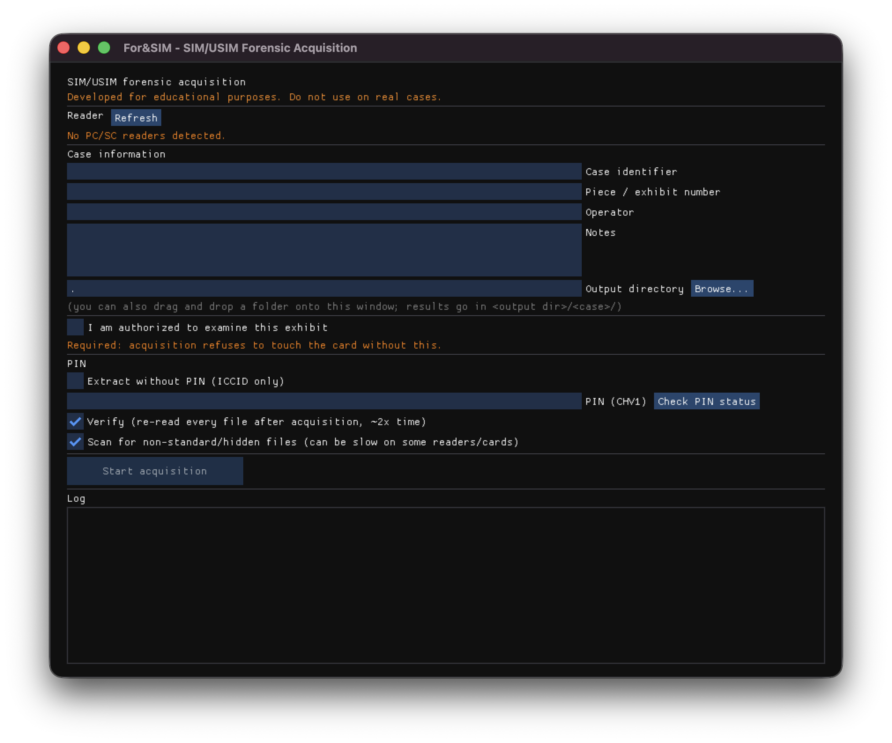

# For&SIM

A SIM/USIM forensic acquisition tool for digital forensics education, originally built
for a classroom setting but usable by anyone who wants to learn how SIM/USIM forensic
acquisition works.

Repository: [https://github.com/Ben0x0a/for-and-SIM](https://github.com/Ben0x0a/for-and-SIM)

> **Educational tool — not for real cases.** This project was built for teaching how
> SIM/USIM forensic acquisition works. It has not been validated against real forensic
> tooling standards (e.g. NIST CFTT) and should not be used to examine evidence in an
> actual investigation.

## What it does

- Connects to a SIM/USIM card through any standard PC/SC USB smart-card reader.
- Without a PIN: reads ICCID plus every other file whose read access condition is
  `ALW` (no PIN needed at all) - `EF_DIR` (installed application AIDs), `EF_PL`
  (preferred languages), `EF_PHASE`. Everything else on a SIM/USIM genuinely
  requires the PIN; there's no way to get more without it.
- If a PIN (CHV1) is supplied and verified, performs a full acquisition: walks the
  classic GSM DF tree (`DF_TELECOM`, `DF_GSM` and their sub-DFs) reading every
  catalog elementary file, plus a brute-force probe of the non-standard EF-id
  ranges (`0x4Fxx`/`0x6Fxx`) *and* the DF-id ranges (`0x5Fxx`/`0x7Fxx`) at every
  level, recursively exploring any undocumented DF it finds. If the card also has
  a USIM application, its AID is discovered via `EF_DIR` (falling back to the
  well-known 3GPP USIM AID if that fails), the ADF is `SELECT`ed, and its
  USIM-specific EFs (3GPP TS 31.102) are walked too.
- Produces, in `<output dir>/<case>/` (a dedicated subfolder per case, so
  multiple acquisitions in the same output directory never mix their files):
  - `<case>.zip` - the evidence container: raw bytes of every acquired file under
    `files/` (except cryptographic key material - see "Sensitive values" below),
    a `values.json` with a fixed set of decoded identity values (ICCID, IMSI,
    MSISDN, SPN, FPLMN, MCC/MNC/LAC from the last registered cell) always
    present with an explicit status even when empty (e.g. no PIN supplied), a
    `manifest.json` with case metadata, tool provenance (including a hash of
    the executable itself and the platform it ran on), chain of custody and a
    SHA-256 per file, and a human-readable `for-and-sim-meta.txt` summary of
    all of the above (itself hashed and recorded in the manifest).
  - `<case>.html` - a standalone, self-contained report with a linked table of
    contents: case info, tool provenance, acquisition results (the evidence
    zip's own hash, interpreted values, and the full extracted-file listing),
    chain of custody & integrity, and the full ISO-8601-timestamped acquisition
    log.

  New to what "file" even means on a SIM? Start with
  [docs/HOW_SIM_STORAGE_WORKS.md](docs/HOW_SIM_STORAGE_WORKS.md) - a
  plain-language explainer of the MF/DF/EF filesystem model, how `SELECT`/`READ`
  work over APDU, and why PIN-gating is per-file, not per-card. See
  [docs/REPORT.md](docs/REPORT.md) for a field-by-field explanation of
  everything in the zip and the HTML report, and
  [docs/GLOSSARY.md](docs/GLOSSARY.md) for every abbreviation used (SIM/USIM,
  MF/DF/EF, ICCID/IMSI, CHV/PUK, APDU/SW1-SW2, ATR, PC/SC, and more).

## Read-only guarantee

This tool never issues an `UPDATE BINARY`, `UPDATE RECORD`, `INVALIDATE` or
`REHABILITATE` command — those APDU builders simply don't exist in `apdu.cpp`.
The one unavoidable exception is `VERIFY CHV` (PIN check): presenting a PIN is
inherently a card-state operation, since a wrong PIN decrements the card's own
retry counter. To make that safe and transparent:

- a `--check-pin` pre-flight (CLI flag, or the GUI's "Check PIN status" button) reads
  the CHV1 retry counter **without ever verifying**, so an operator can see how many
  attempts remain and decide whether to proceed, before committing to a guess;
- the same retry counter is read and logged again immediately before the actual
  verify, with a loud warning if only 0-1 attempts remain;
- after the full acquisition, ICCID is re-read and its hash compared against the
  very first read, as a lightweight always-on integrity check;
- a full verification pass — **on by default**, opt out with `--no-verify` (CLI) or
  by unchecking "Verify" (GUI) — re-reads **every** acquired file and diffs its hash
  against the first read: the real read-only analogue of a "hash before/after"
  check, since there's no way to hash "the whole card" the way one hashes a disk
  image. It roughly doubles acquisition time, same tradeoff as a verify pass in any
  imaging tool.
- all of the above are recorded in the manifest, `for-and-sim-meta.txt`, the HTML
  report, and the acquisition log.

Two more safeguards, unrelated to the PIN:

- **Authorization gate**: acquisition refuses to even connect to the card unless
  the operator explicitly attests authorization (`--confirm-authorized` / the GUI
  checkbox). This refusal is itself recorded if it happens.
- **Anomaly flags**: a file with an unrecognized structure byte, or a read that
  returned fewer bytes than declared, is flagged (`structure_unknown` /
  `size_mismatch` in the manifest, a warning in the log and HTML report) instead
  of silently appearing as an empty/complete file. A `SELECT` failure with a
  status word other than the ordinary "file not found" is also logged as a
  warning, since it can indicate a CLA/class incompatibility rather than genuine
  absence.
- **PIN redaction**: if a PIN was entered, the report says so (`****** —
  educational purpose, PIN value not disclosed`) rather than silently omitting
  it; if no PIN was entered, nothing PIN-related appears at all.
- **No PUK support, on purpose**: `UNBLOCK CHV` (PUK entry) would unblock the
  card *and* set a brand-new PIN chosen by the operator — unlike `VERIFY CHV`,
  that's a genuine, permanent write to the card's security state, not just a
  retry-counter decrement. That's out of scope for a tool built around a
  read-only guarantee, so it's simply not implemented; if it were, it would need
  its own explicit confirmation step and would be logged as the card-state-
  changing action it is, separate from the rest of the (read-only) acquisition.
- **Overwrite protection**: if `<output dir>/<case>/` already has results in it,
  the CLI refuses (pass `--force` to proceed) and the GUI asks for confirmation,
  rather than silently overwriting a previous acquisition.

## Non-standard/hidden file scanning

**Off by default** - a full acquisition without it already reads every catalog
EF (everything `ef_catalog.h` knows about); turn it on with `--scan-hidden`
(CLI) or the GUI checkbox when you specifically want to search for
undocumented files too, since it can be slow: it's a brute-force probe of
every non-standard EF/DF id at every level, which means many extra round-trips
to the card, more so on a slow reader or a card that mishandles `SELECT` (a
small number of test/simulator cards answer "success" for almost any file id,
which without safeguards would make the scan explore an enormous number of
phantom files). Three protections are built in regardless: a cycle guard
(never re-enters an id that's already an ancestor of the current position), a
depth cap (non-standard DF nesting stops after 3 levels), and an anomaly cap
(more than ~8 hits in one 512-id scan is treated as the card mis-answering
`SELECT`, not as 8 genuine hidden files, and stops that scan early with a
warning).

## Sensitive values are never written to disk

A SIM/USIM card can hold cryptographic key material, not just subscriber data:
`EF_Kc` and `EF_KcGPRS` (3GPP TS 51.011 10.3.9/10.3.20) hold the last GSM/GPRS
ciphering session key the card computed. (`Ki`, the card's long-term
authentication key, is *not* included here because it structurally can't be:
no EF ever exposes it - it's used internally by the card's crypto algorithm
and is never readable via any `SELECT`/`READ` command.)

For teaching purposes it's worth showing that this key material exists on the
card at all - but leaving actual key bytes sitting in a `.zip` a student might
forget to delete is a real risk, not just a forensic nicety. So for `EF_Kc`/
`EF_KcGPRS`, For&SIM still selects and reads the file (to prove it's there and
capture its size/hash) but **never writes its raw content anywhere on disk**:
not to `files/` in the zip, not to any log line, nowhere. The report and
manifest still list the file with its SHA-256 and a `content_withheld: true`
flag, so the acquisition is fully accounted for without the actual key
material ever touching your disk.

This only covers the two known key-material EFs in the catalog - a
non-standard/hidden file discovered by the brute-force scan (labeled
`UNKNOWN_xxxx`, since its purpose is unknown) is *not* automatically withheld,
because For&SIM has no way to know it's sensitive.

## Building

Requires CMake 3.16+ and a C++17 compiler.

```
cmake -S . -B build -DFORANDSIM_BUILD_GUI=ON
cmake --build build --config Release
```

- `FORANDSIM_BUILD_GUI` (default `ON`) requires SDL2; if SDL2 isn't found, the
  build automatically falls back to a CLI-only binary with a warning.
- On Windows the build uses the static CRT (`/MT`) so the shipped `.exe` needs no
  Visual C++ Redistributable install — students only need the single `.exe` file
  (plus SDL2 if it's dynamically linked; use a static SDL2 triplet, e.g. via
  vcpkg's `sdl2:x64-windows-static`, to keep it a single file, as CI does).
- macOS/Linux dev machines can compile-check the PC/SC code without a physical
  reader: macOS ships `PCSC.framework` (Windows-API-compatible headers) and Linux
  needs `libpcsclite-dev`.

Run the output-layer smoke test (no hardware needed):

```
ctest --test-dir build --output-on-failure
```

## Usage

For a full walkthrough (build → find your reader → check the PIN safely → acquire →
read the report), see [docs/TUTORIAL.md](docs/TUTORIAL.md).

### GUI (default, no arguments)

```
forandsim
```



Check "I am authorized to examine this exhibit", fill in case identifier,
piece/exhibit number, operator, notes and output directory (type a path, click
"Browse...", or drag and drop a folder onto the window), pick a reader,
optionally click "Check PIN status" first, then either enter the PIN or check
"Extract without PIN (ICCID only)", and click Start. "Verify" is checked by
default; "Scan for non-standard/hidden files" is *not* (check it if you
specifically want to search for undocumented files too - see the section
below for the tradeoff). While running, a "Stop" button appears next to the
progress text — it cancels cleanly at the next checkpoint and still writes out
whatever was read so far, rather than a hard kill. If results already exist in
the target folder, a confirmation dialog appears before overwriting.

### CLI (headless)

```
forandsim --list-readers
forandsim --check-pin --reader "ACS ACR38U-CCID 0"
forandsim --reader "ACS ACR38U-CCID 0" --case CASE-2026-014 --piece P1 \
          --operator "J. Examiner" --output ./out --confirm-authorized --pin 1234
forandsim --reader "ACS ACR38U-CCID 0" --case CASE-2026-014 --piece P1 \
          --operator "J. Examiner" --output ./out --confirm-authorized --pin 1234 \
          --scan-hidden
forandsim --reader "ACS ACR38U-CCID 0" --case CASE-2026-014 --piece P1 \
          --operator "J. Examiner" --output ./out --confirm-authorized --no-pin --no-verify
```

Results land in `./out/CASE-2026-014/`. Re-running with the same `--case` and
`--output` refuses (existing results would be overwritten) unless you add
`--force`.

## Ethics note

Only use this tool on SIM/USIM cards you are authorized to examine (test cards
provided for a course/lab, or cards you own). Entering a wrong PIN decrements the
card's retry counter and can permanently block a real card without its PUK. This
tool is for learning how SIM/USIM forensic acquisition works — do not use it on
real evidence.

**How sensitive is a produced report, really?** ICCID and IMSI are personal
data - they can identify and, combined with carrier cooperation, help locate a
specific subscriber, which is why real operators treat them as PII. That risk
is real but bounded: on their own, an ICCID/IMSI pair does not let anyone clone
the SIM, intercept calls/SMS, or take over the account - that would need `Ki`,
the card's long-term authentication key, which no EF ever exposes and this
tool has no way to extract (see the "Sensitive values" section above for what
*is* extractable and why key material specifically is never written to disk).
For a classroom exercise using cards students already control (their own, or
disposable course-provided test cards), a produced report is fine to
handle/share the way you'd treat any personal-data spreadsheet - keep it
reasonably private, don't publish it, but it isn't a "shred immediately"
level secret.

## Known limitations

- The brute-force probes (both the non-standard-file scan and the USIM AID
  discovery) don't cover the USIM ADF itself: once inside the ADF, only the
  catalog EFs in `catalog::usimAdfEfs()` are read - there's no brute-force
  search for hidden/non-standard files there yet, unlike the classic
  MF/DF_GSM/DF_TELECOM tree.
- The brute-force probes only scan the conventional EF (`0x4Fxx`/`0x6Fxx`) and DF
  (`0x5Fxx`/`0x7Fxx`) ranges per level, not the full 16-bit id space; a full scan
  would be far slower for little additional coverage. This does mean a file
  deliberately hidden outside those conventional ranges would be missed.
- USIM AID discovery only recognizes the standard 3GPP USIM AID prefix
  (`A0 00 00 00 87 10 02`); a card whose USIM uses a different/customized AID
  and has no `EF_DIR` entry for it (or an unreadable `EF_DIR`) won't be found.
- An operator-requested Stop is handled gracefully (partial results are still
  written, with `cancelled: true` in the manifest). An *unexpected* hardware
  error mid-walk (card removed, reader glitch — a `SCardTransmit` failure) is
  not: the whole acquisition throws and nothing is written to disk.
- Workstation timestamps are the local system clock, not validated against any
  trusted time source (acceptable for an offline educational tool, but worth
  knowing if this were ever used for real casework).
